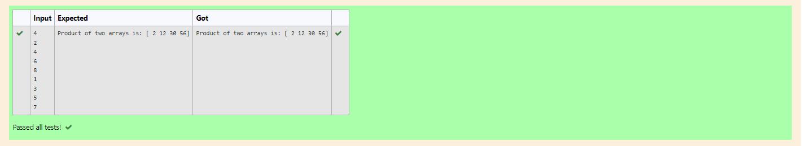

# Multiplying-two-matrix

## AIM:
To write a program to perform Multiplying-two-matrix using python programming.

## ALGORITHM:

### Step 1:
Import Numpy as np.

### Step 2:
Get input from the user.

### Step 3:
Create empty lists l1 and l2.

### Step 4:
Use for loop to append the values into the list created.

### Step 5:
Print the product of two arrays.

## PROGRAM: 
```
#Name: Parshwanath
#Ref No: 21002544

import numpy as np

l1,l2 =[],[]

n = int(input())

for i in range(n):

     l1.append(int (input()))

for i in range(n):
     l2.append(int (input()))
value1=np.array(l1)
value2= np.array(l2)

result = value1*value2


print("Product of two arrays is:", result)
```
## OUTPUT:


## RESULT:
The Excepted output has been generated.

